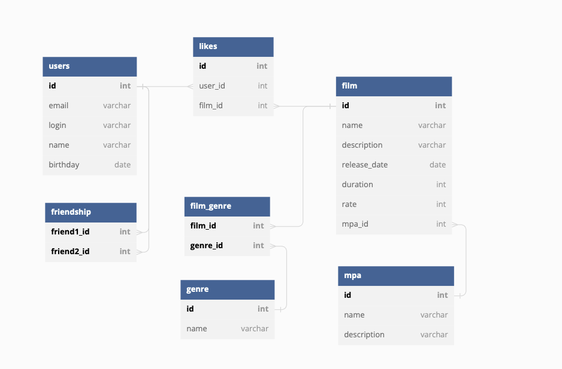

# java-filmorate
# diagram



 ### Данная диаграмма представляет собой визуальное отражение базы данных, которая была создана для хранения информации самого приложения. 


### Примеры запросов:
1.
```
SELECT FS.friend2_id

FROM friendship as FS

WHERE friend1_id = 1

GROUP BY FS.friend2_id;
```

2.
```
SELECT L.user_id

FROM likes as L

WHERE film_id = 3

GROUP BY L.user_id

ORDER BY L.user_id DESC;
```

### Также прикрепляю отзыв моего одногруппника на мою диаграмму, после комментария внесла изменения


